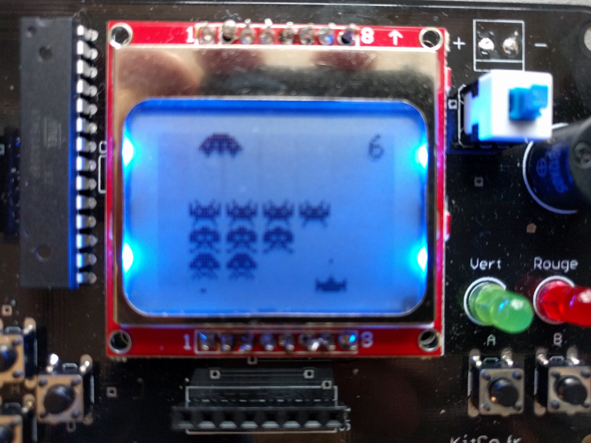

# Des jeux pour la console kitco (http://kitco.fr)

Pour pouvoir les utiliser, il faut installer l'IDE Arduino ainsi que des librairies de développement,
comme décrit sur https://kitco.fr/grid/programmer-kitco/.

Pour transférer les fichiers sur la console, le plus simple est de copier/coller le contenu du fichier `.ino` principal
(sélectionner tout le contenu du fichier, puis Ctrl-C pour copier le contenu, puis Ctrl-V dans un nouveau fichier
dans l'IDE Arduino).

Vous pouvez également cloner ce repository.

## [Space Invaders](/invaders)

Un clone du [jeu d'arcade Space Invaders](https://fr.wikipedia.org/wiki/Space_Invaders),
développé début 2018 (environ 20h de travail).

Code source [ici](/invaders).

